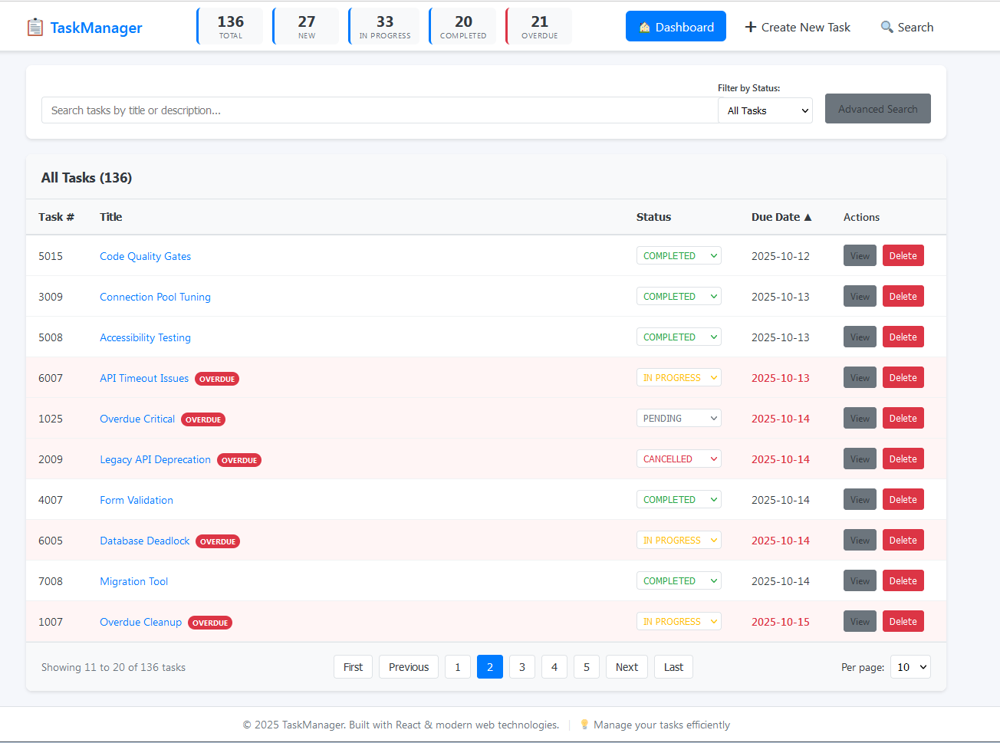

# Full-Stack Task Management System (Kelly Task Demo)

A full-stack task management application with comprehensive testing, built with Spring Boot (backend) and React (frontend).

[](LICENSE)
[](https://openjdk.org/)
[](https://spring.io/projects/spring-boot)
[](https://reactjs.org/)

---

## 🎯 Overview

This is a full-stack task management system designed with enterprise-grade patterns and comprehensive test coverage. The application demonstrates:

- **Clean Architecture** with clear separation of concerns
- **RESTful API** following best practices
- **Comprehensive Testing** (unit, integration, functional, smoke, E2E)
- **Database Migrations** with Flyway
- **Containerized Development** with Docker Compose
- **Automated Testing** with Testcontainers
- **Code Quality Tools** (Spotless, Checkstyle, OWASP)
- **API Documentation** with OpenAPI/Swagger

### 📸 Application Screenshots


_Task Management Dashboard - View and manage all your tasks with real-time status updates_

---

## ✨ Features

### Task Management

- ✅ Create, read, update, and delete tasks
- ✅ Advanced search with multiple filters (title, description, status)
- ✅ Task status management (TODO, IN_PROGRESS, DONE)
- ✅ Real-time validation and error handling
- ✅ Optimistic UI updates

### Developer Experience

- 🚀 Fast development with hot reload (Vite + Spring DevTools)
- 🐳 Containerized development environment (Alpine Linux)
- 📝 Comprehensive test suites with multiple levels
- 📊 Test coverage reporting (JaCoCo + Vitest)
- 🔍 Code quality enforcement (Spotless, Checkstyle)
- 📚 Interactive API documentation (Swagger UI)
- 🎯 Unified build and test scripts

---

## 🛠 Technology Stack

### Backend (kellybackendtask)

- **Java 21** with modern language features
- **Spring Boot 3.5.5** (Web, Data JPA, Validation)
- **PostgreSQL** for production, **H2** for development
- **Flyway** for database migrations
- **Gradle 8.11.1** for build automation
- **Testcontainers** for E2E testing with real PostgreSQL
- **OpenAPI 3** for API documentation

### Frontend (kellyfrontendtask)

- **React 18.2** with hooks
- **React Router 6** for navigation
- **Vite 7** for fast builds and HMR
- **Axios** for API communication
- **Vitest** for testing
- **Testing Library** for React component testing

### Development Tools

- **Docker** & **Docker Compose** for containerization
- **Alpine Linux 3.22** as base image
- **Spotless** for code formatting
- **Checkstyle** for code quality
- **JaCoCo** for Java coverage
- **Vitest Coverage** for frontend coverage
- **OWASP Dependency Check** for security scanning

---

## 🚀 Quick Start

### Prerequisites

- Docker (for dev container environment)
- Or: Java 21, Node.js 18+, PostgreSQL 15+ (for local development)

### Option 1: Dev Container (Recommended)

1. **Open in VS Code with Dev Containers extension:**

   ```bash
   # VS Code will detect .devcontainer and offer to reopen in container
   # Or use Command Palette: "Dev Containers: Reopen in Container"
   ```

2. **Install dependencies:**

   ```bash
   npm run deps:install
   # or
   sh scripts/install-all-deps.sh
   ```

3. **Start development database:**

   ```bash
   sh scripts/dev-db.sh
   ```

4. **Build everything:**

   ```bash
   npm run build:all
   # or
   sh ./build-all.sh
   ```

5. **Run the application:**

   ```bash
   # Terminal 1: Backend (port 4000)
   cd kellybackendtask
   ./gradlew bootRun -Dspring.profiles.active=devdb

   # Terminal 2: Frontend (port 3000)
   cd kellyfrontendtask
   npm run dev
   ```

6. **Access the application:**
   - Frontend: http://localhost:3000
   - Backend API: http://localhost:4000/api/tasks
   - API Documentation: http://localhost:4000/swagger-ui
   - API Info: http://localhost:4000/api/info

### Option 2: Local Development

1. **Clone the repository:**

   ```bash
   git clone <repository-url>
   cd DTS1
   ```

2. **Start PostgreSQL:**

   ```bash
   sudo docker compose -f docker-compose.dev-db.yml up -d
   ```

3. **Install dependencies and build:**

   ```bash
   npm run deps:install
   npm run build:all
   ```

4. **Run the applications** (same as dev container step 5)

---

## 💻 Development

### Build Commands

```bash
# Build everything (backend + frontend, all tests)
npm run build:all
sh ./build-all.sh

# Build backend only
npm run build:backend
sh ./build-all.sh backend

# Build frontend only
npm run build:frontend
sh ./build-all.sh frontend

# Install all dependencies
npm run deps:install
sh scripts/install-all-deps.sh
```

### Backend Development

```bash
cd kellybackendtask

# Run with H2 (in-memory, no external database)
./gradlew bootRun

# Run with PostgreSQL
./gradlew bootRun -Dspring.profiles.active=devdb

# Run tests
./gradlew test                    # Unit tests
./gradlew integrationTest         # Integration tests
./gradlew functionalTest          # Functional tests
./gradlew smokeTest              # Smoke tests
./gradlew e2e                    # E2E tests (Testcontainers)

# Code quality
./gradlew check                  # All quality checks
./gradlew spotlessApply          # Format code
./gradlew checkstyleMain         # Checkstyle
./gradlew dependencyCheckAnalyze # Security scan

# Generate coverage report
./gradlew test jacocoTestReport
# Open: build/reports/jacoco/test/html/index.html
```

### Frontend Development

```bash
cd kellyfrontendtask

# Development server (hot reload)
npm run dev                      # Port 3000

# Build for production
npm run build

# Run tests
npm test                         # All tests
npm run test:watch               # Watch mode
npm run test:coverage            # With coverage

# Test categories
npm run test:unit:cat            # Unit tests only
npm run test:integration:cat     # Integration tests
npm run test:functional:cat      # Functional tests
npm run test:smoke:cat           # Smoke tests
```
---

## 🧪 Testing

This project has **comprehensive test coverage** with multiple test levels:

### Test Categories

| Category        | Backend      | Frontend     | Purpose                                 |
| --------------- | ------------ | ------------ | --------------------------------------- |
| **Unit**        | ✅ 20+ tests | ✅ 15+ tests | Test individual components in isolation |
| **Integration** | ✅ 15+ tests | ✅ 10+ tests | Test component interaction              |
| **Functional**  | ✅ 8+ tests  | ✅ 8+ tests  | Test complete workflows                 |
| **Smoke**       | ✅ 3 tests   | ✅ 2 tests   | Quick validation of critical paths      |
| **E2E**         | ✅ 5 tests   | N/A          | Full system with real PostgreSQL        |


### Run Specific Test Categories

```bash
# Backend specific categories
npm run test:backend:unit
npm run test:backend:integration
npm run test:backend:functional
npm run test:backend:smoke

# Frontend specific categories
npm run test:frontend:unit
npm run test:frontend:integration
npm run test:frontend:smoke
```

### E2E Testing with Testcontainers

The E2E tests use **Testcontainers** to automatically:

1. Pull `postgres:16-alpine` Docker image (if not cached)
2. Start PostgreSQL container with random port
3. Run Flyway migrations
4. Execute tests against real PostgreSQL
5. Clean up container after tests

**No manual database setup required!**

# Gradle (backend directory)
cd kellybackendtask
./gradlew e2e
```

### Test Reports

```bash
# Serve all test reports on port 8080
npm run reports:serve

# Generate unified test logs
npm run logs:index:test

# Access reports:
# - Backend coverage: http://localhost:8080/build-logs/
# - Frontend coverage: http://localhost:8080/kellyfrontendtask/coverage/
# - Test logs: http://localhost:8080/test-logs/
```

### Key Endpoints

| Method   | Endpoint            | Description      |
| -------- | ------------------- | ---------------- |
| `GET`    | `/`                 | Welcome message  |
| `GET`    | `/api/info`         | Application info |
| `GET`    | `/api/tasks`        | List all tasks   |
| `POST`   | `/api/tasks`        | Create task      |
| `GET`    | `/api/tasks/{id}`   | Get task by ID   |
| `PUT`    | `/api/tasks/{id}`   | Update task      |
| `DELETE` | `/api/tasks/{id}`   | Delete task      |
| `GET`    | `/api/tasks/search` | Search tasks     |

### API Request Examples

```bash
# List tasks
curl http://localhost:4000/api/tasks

# Create task
curl -X POST http://localhost:4000/api/tasks \
  -H "Content-Type: application/json" \
  -d '{"title":"New Task","description":"Description","status":"TODO"}'

# Search tasks
curl "http://localhost:4000/api/tasks/search?title=test&status=TODO"

# Update task
curl -X PUT http://localhost:4000/api/tasks/1 \
  -H "Content-Type: application/json" \
  -d '{"title":"Updated","description":"New description","status":"DONE"}'

# Delete task
curl -X DELETE http://localhost:4000/api/tasks/1
```

---

## 🗄 Database

### Development Database

# Apply migrations manually
npm run db:apply-schema
```

**Connection Details:**

- Host: `localhost`
- Port: `55432` (configurable via `PG_HOST_PORT`)
- Database: `devdb`
- Username: `devuser`
- Password: `devpass`

### Database Migrations

Migrations are managed with **Flyway** and located in:

```
kellybackendtask/src/main/resources/db/migration/
```

**Migration naming:** `V{version}__{description}.sql`

Example:

- `V1__Create_task_table.sql`
- `V2__Add_task_status.sql`

Migrations run automatically on application startup.

### Access Database

```bash
# Using docker exec
sudo docker exec -it dts-dev-postgres psql -U devuser -d devdb

# Using psql (if installed locally)
psql -h localhost -p 55432 -U devuser -d devdb
```
---

# Run tests with coverage
npm run test:coverage

# Serve reports
npm run reports:serve
```
---

## ⚙️ Configuration

### Environment Variables

**Backend:**

```bash
# Database
SPRING_DATASOURCE_URL=jdbc:postgresql://localhost:55432/devdb
SPRING_DATASOURCE_USERNAME=devuser
SPRING_DATASOURCE_PASSWORD=devpass

# Spring Profile
SPRING_PROFILES_ACTIVE=dev  # or: devdb, test, e2e

# Server Port
SERVER_PORT=4000
```

**Frontend:**

```bash
# API Configuration
VITE_API_TARGET=http://localhost:4000
VITE_PORT=3000
VITE_AUTO_OPEN=0  # Set to 1 to auto-open browser
```

### Spring Profiles

| Profile | Database       | Use Case                          |
| ------- | -------------- | --------------------------------- |
| `dev`   | H2 in-memory   | Quick development, no external DB |
| `devdb` | PostgreSQL     | Development with persistent DB    |
| `test`  | H2 in-memory   | Unit/functional tests             |
| `e2e`   | Testcontainers | E2E tests with real PostgreSQL    |

### Docker Compose Files

| File                        | Purpose                | Port  |
| --------------------------- | ---------------------- | ----- |
| `docker-compose.dev-db.yml` | Development PostgreSQL | 55432 |
| `docker-compose.db.yml`     | Test PostgreSQL        | 5432  |

---

## 🔍 Troubleshooting

### Common Issues

**1. Port Already in Use**

```bash
# Check what's using the port
lsof -i :4000  # Backend
lsof -i :3000  # Frontend
lsof -i :55432 # Database

# Kill the process
kill -9 <PID>
```

**2. Database Connection Issues**

```bash
# Check if database is running
sudo docker ps | grep postgres

# Restart database
sh scripts/dev-db.sh

# Check database logs
sudo docker logs dts-dev-postgres
```

**3. Build Failures**

```bash
# Clean and rebuild backend
cd kellybackendtask
./gradlew clean build --no-daemon

# Clean and rebuild frontend
cd kellyfrontendtask
rm -rf node_modules dist
npm install
npm run build
```

**4. Test Failures**

```bash
# Run with verbose logging
sh ./test-all.sh --verbose

# Check test logs
ls -la test-logs/
cat test-logs/backend-unit-*.log

# Serve reports for detailed analysis
npm run reports:serve
```

**5. Docker Permission Issues**

```bash
# Fix docker socket permissions
sudo chmod 666 /var/run/docker.sock

# Or add user to docker group (requires logout/login)
sudo usermod -aG docker $USER
```

**6. Memory Issues**

```bash
# Check available memory
free -h

# Set conservative Gradle options
export GRADLE_OPTS="-Xmx1g -XX:MaxMetaspaceSize=512m"

# Run with memory-aware settings
FAST_TEST=1 sh ./test-all.sh
```

### Debug Mode

```bash
# Enable debug output
E2E_DEBUG=1 sh ./e2e.sh

# Backend with debug logging
./gradlew bootRun --debug -Dlogging.level.root=DEBUG

# Frontend with verbose errors
npm run dev -- --debug
```

### Clean Everything

```bash
# Remove all build artifacts and caches
make clean  # If Makefile exists

# Or manually:
rm -rf build-logs test-logs
rm -rf kellybackendtask/build
rm -rf kellyfrontendtask/dist kellyfrontendtask/node_modules
sudo docker compose -f docker-compose.dev-db.yml down -v
```
---

## 📝 Code Quality

### Automated Checks

The project enforces code quality through:

- ✅ **Spotless** - Automated code formatting
- ✅ **Checkstyle** - Code style validation
- ✅ **Compiler Warnings** - Treated as errors
- ✅ **OWASP Dependency Check** - Security vulnerability scanning
- ✅ **JaCoCo** - Code coverage reporting
- ✅ **ESLint** - Frontend code quality (if configured)

### Running Quality Checks

```bash
# Backend
cd kellybackendtask
./gradlew check                   # All checks
./gradlew spotlessApply           # Auto-format
./gradlew checkstyleMain          # Style check
./gradlew dependencyCheckAnalyze  # Security scan

# Frontend
cd kellyfrontendtask
npm run typecheck                 # TypeScript checks
npm run test:coverage             # Coverage report
```
---

## 🚢 Production Deployment

### Build for Production

# Backend JAR location
ls -lh kellybackendtask/build/libs/*.jar

# Frontend static files
ls -lh kellyfrontendtask/dist/
```

### Run Production Build

```bash
# Backend (requires PostgreSQL)
export SPRING_DATASOURCE_URL=jdbc:postgresql://prod-host:5432/taskdb
export SPRING_DATASOURCE_USERNAME=prod_user
export SPRING_DATASOURCE_PASSWORD=secure_password
java -jar kellybackendtask/build/libs/kellybackendtask-0.0.1.jar

# Frontend (serve static files)
# Use nginx, Apache, or any static file server
# Point to: kellyfrontendtask/dist/
```
